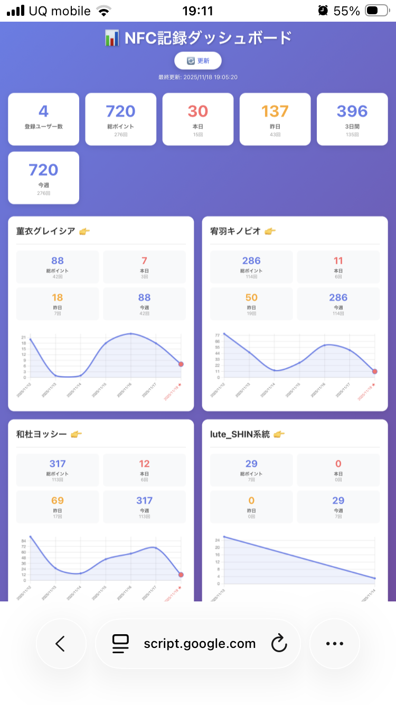

# NFC キッズポイントシステム 🎯

子供向けのNFCタグを使った楽しいポイント管理システムです。NFCタグをスキャンすることで自動的にポイントが蓄積され、リアルタイムでダッシュボードに反映されます。

## 🖥️ 実際のシステム画面



**上記は実際の動作中ダッシュボード画面です**
- 📊 リアルタイム統計表示
- 👥 各ユーザーの詳細ポイント状況  
- 📈 美しいChart.jsグラフ
- 🎯 クリックで個別詳細画面へ遷移

## 🌟 特徴

- **📱 iPhone ショートカット連携**: NFCタグを読み込むだけで自動実行
- **🎯 インタラクティブポイント選択**: その場でポイント数を選択可能
- **📊 リアルタイムダッシュボード**: Google Apps Scriptで動的なWebダッシュボードを提供
- **📈 詳細な分析機能**: 日別・時間別・曜日別の統計グラフ
- **🎨 レスポンシブデザイン**: モバイルフレンドリーなUI
- **⚡ 高速表示**: Chart.jsによる軽量で美しいグラフ
- **🔄 自動更新**: リアルタイムでのデータ反映
- **🔊 フィードバック機能**: 振動・サウンドによる操作確認
- **👶 子供向け**: 分かりやすいUIと楽しいポイント表示

## 🚀 システム構成

```
NFCタグ → iPhone → ショートカット → Google Apps Script → スプレッドシート → Webダッシュボード
```

### 構成要素

1. **NFCタグ**: 各子供に割り当てられた識別タグ
2. **iPhone ショートカット**: NFCスキャン時の自動処理
3. **Google Apps Script**: バックエンド処理とWeb API
4. **Google スプレッドシート**: データ保存
5. **Webダッシュボード**: 統計表示とリアルタイム監視

## 📋 機能一覧

### メインダッシュボード
- 👥 登録ユーザー数
- 📊 総ポイント/記録回数表示
- 📅 本日・昨日・3日間・今週の統計
- 📈 ユーザー別ポイント推移グラフ
- 🔄 自動更新機能

### ユーザー詳細ページ
- 📅 日別ポイント推移
- 🕐 時間帯別ポイント分析
- 📆 曜日別ポイント統計
- 📝 記録履歴（最新20件）
- 🎯 総ポイント表示

## 🛠️ セットアップ

### 必要なもの
- iPhone（iOS 13以降推奨）
- Googleアカウント
- NFCタグ（NTAG213推奨）

### 1. Google スプレッドシート設定

1. 新しいスプレッドシートを作成
2. Apps Scriptエディタを開く
3. `scripts/Code.gs` をコピーして貼り付け
4. Webアプリとして公開

### 2. iPhone ショートカット設定

1. ショートカットアプリを開く
2. 新規ショートカットを作成
3. NFCスキャン時のアクションを設定
4. WebリクエストでGoogle Apps Scriptへデータ送信

詳細な設定手順は以下のガイドを参照してください：
- [基本セットアップガイド](docs/setup-guide.md)
- [改良版iPhoneショートカット設定](docs/iphone-shortcut-setup-v2.md) - **NEW!**

## 🌐 ライブデモ

**ダッシュボードデモ**: https://script.google.com/macros/s/AKfycbz1NMadryd4_VxmKR9QiFZgZfJyUeF0TbTXEv1oE1M4ql5Dng2Xd_-x-1Ynw8FoqcxyzA/exec?action=dashboard

## 📸 システムスクリーンショット

### 📊 システムダッシュボード

*リアルタイム統計とインタラクティブなユーザー管理画面*

### 📱 iPhone設定手順
| ショートカット作成 | オートメーション設定 | NFCスキャン設定 |
|---|---|---|
|  |  |  |

*改良版インタラクティブショートカット設定画面*

詳細な設定手順は [詳細セットアップガイド](docs/detailed-setup-with-screenshots.md) をご覧ください。

## 📊 ダッシュボードの使い方

### メイン画面
- **総合統計**: システム全体の利用状況を確認
- **ユーザーカード**: 各ユーザーをクリックして詳細表示
- **更新ボタン**: 最新データを手動更新

### ユーザー詳細画面
- **日別グラフ**: ポイント獲得の推移を確認
- **時間別グラフ**: 活動時間帯の分析
- **曜日別グラフ**: 週単位での活動パターン
- **履歴テーブル**: 最新の記録を時系列で表示

## 🔧 カスタマイズ

### ポイント設定
```javascript
// デフォルトポイントの変更
let points = parseInt(innerData.points) || 1; // ここの数値を変更
```

### UI テーマ
```css
/* カラーテーマの変更 */
.stat-number.today { color: #ff6b6b; }
.stat-number.yesterday { color: #ffa726; }
```

### グラフ設定
```javascript
// Chart.js設定のカスタマイズ
borderColor: 'rgb(66,133,244)',
backgroundColor: 'rgba(66,133,244,0.1)',
```

## 🐛 トラブルシューティング

### よくある問題

**Q: NFCタグが反応しない**
- iPhoneのNFC機能が有効になっているか確認
- ショートカットの設定が正しいか確認
- NFCタグの位置を調整

**Q: ダッシュボードにデータが表示されない**
- Apps Scriptの権限設定を確認
- Webアプリの公開設定を確認
- ブラウザのキャッシュをクリア

**Q: グラフが表示されない**
- インターネット接続を確認（Chart.js読み込み）
- ブラウザのJavaScriptが有効か確認

## 🤝 コントリビューション

プルリクエストやイシューの報告をお待ちしています！

1. このリポジトリをフォーク
2. 機能ブランチを作成 (`git checkout -b feature/amazing-feature`)
3. 変更をコミット (`git commit -m 'Add amazing feature'`)
4. ブランチにプッシュ (`git push origin feature/amazing-feature`)
5. プルリクエストを作成

## 📄 ライセンス

このプロジェクトは MIT ライセンスの下で公開されています。詳細は [LICENSE](LICENSE) ファイルを参照してください。

## 🙏 謝辞

- Chart.js チーム - 素晴らしいグラフライブラリ
- Google Apps Script チーム - 強力な自動化プラットフォーム
- Apple ショートカット チーム - 直感的な自動化ツール

---

**作成者**: [あなたの名前]  
**バージョン**: 1.0.0  
**最終更新**: 2024年11月