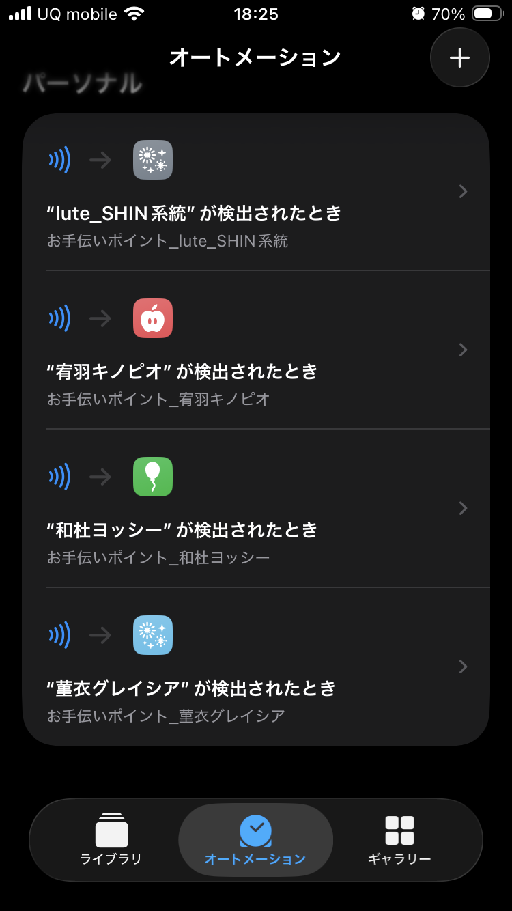
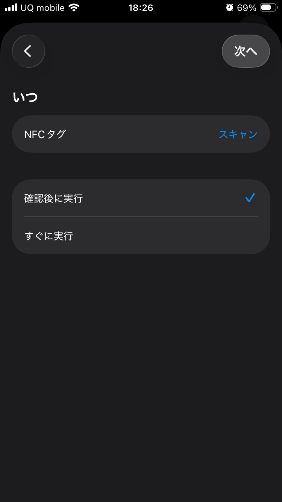

# 詳細セットアップガイド（画像付き） 📸

実際のスクリーンショットを使った、NFCキッズポイントシステムの詳細導入手順を説明します。

## 📱 iPhoneショートカット設定手順

### 前提：必要なもの
- iPhone（iOS 13以降）
- ショートカットアプリ（プリインストール）
- NFCタグ
- Google Apps ScriptのWebアプリURL

---

## 🚀 Step 1: 新規ショートカット作成

### 1.1 ショートカットアプリを開く


1. ホーム画面から「ショートカット」アプリをタップ
2. 右上の「+」ボタンをタップして新規作成開始
3. 「アクションを追加」をタップしてアクション選択画面へ

---

## 📝 Step 2: アクション設定

### 2.1 Webリクエストアクションを追加


#### 手順：
1. **検索バーで「Web」と入力**
2. **「Webの内容を取得」アクションを選択**
3. **以下の設定を行う：**

```
URL: [Google Apps ScriptのWebアプリURL]
例: https://script.google.com/macros/s/AKfycbz1NMadryd4_VxmKR9QiFZgZfJyUeF0TbTXEv1oE1M4ql5Dng2Xd_-x-1Ynw8FoqcxyzA/exec

メソッド: POST

ヘッダ:
Content-Type: application/json

本文: JSON形式で以下を入力
{
  "nfcId": "nfc-taro-001",
  "tagName": "太郎", 
  "points": 1
}
```

### 2.2 通知アクション追加（オプション）


**成功通知の設定：**
1. 「通知を表示」アクションを追加
2. 以下のように設定：
   ```
   タイトル: ポイント記録完了！
   本文: [子供の名前]のポイントが記録されました
   ```

---

## ⚙️ Step 3: NFCオートメーション設定

### 3.1 オートメーションタブに移動
1. ショートカットアプリ下部の「オートメーション」をタップ
2. 右上の「+」ボタンをタップ
3. 「個人用オートメーションを作成」をタップ

### 3.2 NFCトリガー設定
1. **「NFC」を選択**
2. **NFCタグをiPhoneの上部（カメラ付近）にかざす**
3. **タグが認識されたら「次へ」をタップ**

### 3.3 ショートカット関連付け
1. **「ショートカットを実行」を選択**
2. **作成したショートカットを選択**
3. **「実行前に尋ねる」をOFFにする**
4. **「完了」をタップ**

---

## 🎯 各子供用の個別設定例

### 太郎くん用
```json
{
  "nfcId": "nfc-taro-001",
  "tagName": "太郎",
  "points": 1
}
```

### 花子ちゃん用
```json
{
  "nfcId": "nfc-hanako-001", 
  "tagName": "花子",
  "points": 1
}
```

### 特別活動用（宿題完了）
```json
{
  "nfcId": "nfc-taro-homework",
  "tagName": "太郎",
  "points": 5
}
```

---

## 🔧 高度な設定オプション

### A. 条件分岐による時間制限
**平日のみポイント付与する場合：**
1. 「現在の日付を取得」アクションを追加
2. 「if文」アクションで条件分岐
3. 曜日をチェックして平日の場合のみWebリクエスト実行

### B. 変数を使った動的設定
**ユーザー名を変数化する場合：**
```
アクション1: テキスト → 変数"UserName"に"太郎"を設定
アクション2: テキスト → JSONデータに変数を埋め込み
{
  "nfcId": "nfc-[変数:UserName]-001",
  "tagName": "[変数:UserName]",
  "points": 1
}
```

### C. エラーハンドリング
**通信エラー時の対応：**
1. Webリクエストの後に「if文」を追加
2. レスポンスの"status"をチェック
3. エラーの場合は別の通知を表示

---

## 🧪 動作テスト手順

### テスト1: 手動実行
1. ショートカットアプリでショートカットをタップ
2. 正常に実行されることを確認
3. Google スプレッドシートにデータが記録されることを確認

### テスト2: NFCスキャンテスト
1. NFCタグをiPhoneにかざす
2. 自動でショートカットが実行されることを確認
3. 通知が表示されることを確認

### テスト3: ダッシュボード確認
1. WebアプリURL + `?action=dashboard`にアクセス
   ```
   例: https://script.google.com/macros/s/AKfycbz1NMadryd4_VxmKR9QiFZgZfJyUeF0TbTXEv1oE1M4ql5Dng2Xd_-x-1Ynw8FoqcxyzA/exec?action=dashboard
   ```
2. 記録されたデータが表示されることを確認
3. グラフが正常に表示されることを確認

---

## 🚨 トラブルシューティング

### 問題1: NFCタグが反応しない
**原因と対処法：**
- iPhone上部（カメラ付近）に正しく位置付けているか確認
- ケースが厚い場合は外して試行
- NFC機能がONになっているか設定で確認
- NFCタグが故障していないか別のアプリで確認

### 問題2: Webリクエストが失敗する
**原因と対処法：**
- WebアプリのURLが正しく設定されているか確認
- Google Apps Scriptの公開設定を確認
- JSONフォーマットが正しいか確認
- インターネット接続を確認

### 問題3: データがスプレッドシートに記録されない
**原因と対処法：**
- Apps Scriptの実行権限を確認
- スプレッドシートのアクセス権限を確認
- Webアプリの公開設定が「全員」になっているか確認

---

## 📊 効果的な運用のコツ

### 1. ポイント制度の設計
```
基本的な習慣: 1-2ポイント
- 歯磨き、着替え、整理整頓

勉強・宿題: 3-5ポイント  
- 宿題完了、読書、学習時間

お手伝い: 2-4ポイント
- 食器洗い、掃除、洗濯物畳み

特別な成果: 5-10ポイント
- テストの良い点、特別な努力
```

### 2. 家族でのルール作り
- ポイントの使い道を事前に相談
- 週間・月間の目標設定
- ダッシュボードを定期的に一緒に確認
- 不正利用防止のためのタグ管理

### 3. モチベーション維持
- 成長の可視化（グラフで確認）
- 達成感のある通知設定
- 兄弟間での健全な競争
- 定期的なシステムの見直し

---

## 🎉 導入完了後のチェックリスト

- [ ] 各子供用のNFCタグとショートカットが正常動作
- [ ] ダッシュボードが正常に表示される
- [ ] 統計グラフが正しく更新される
- [ ] 通知が適切に表示される
- [ ] 家族全員がシステムの使い方を理解
- [ ] ポイント制度とルールが明確化
- [ ] トラブル時の対処法を把握

---

## 📞 さらなるサポート

より詳細な情報については：
- [基本セットアップガイド](setup-guide.md)
- [システム構成図](system-architecture.md) 
- [GitHubリポジトリ](https://github.com/lutelute/nfc-kids-point-system)

**成功の秘訣**: 段階的に導入し、家族全員で楽しみながらシステムを育てていくことです！