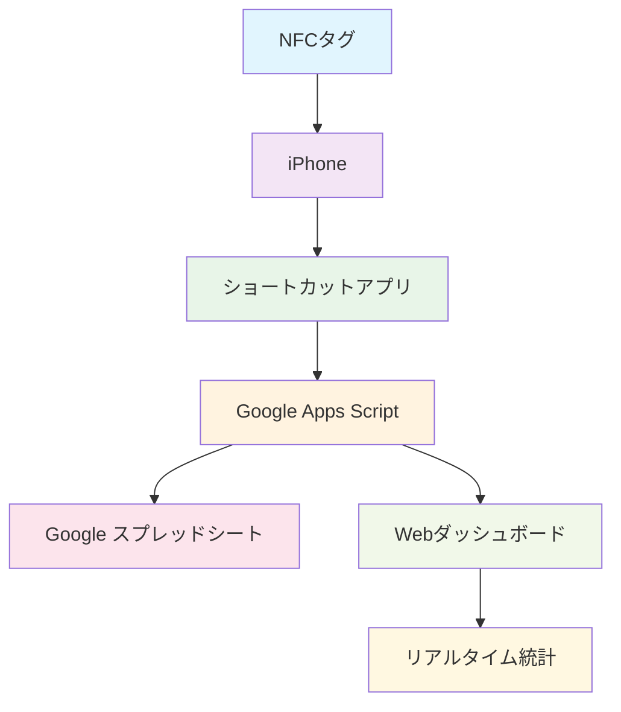
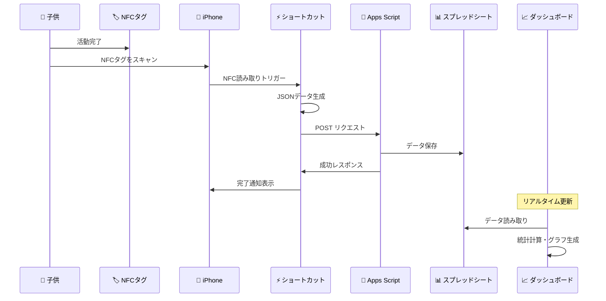
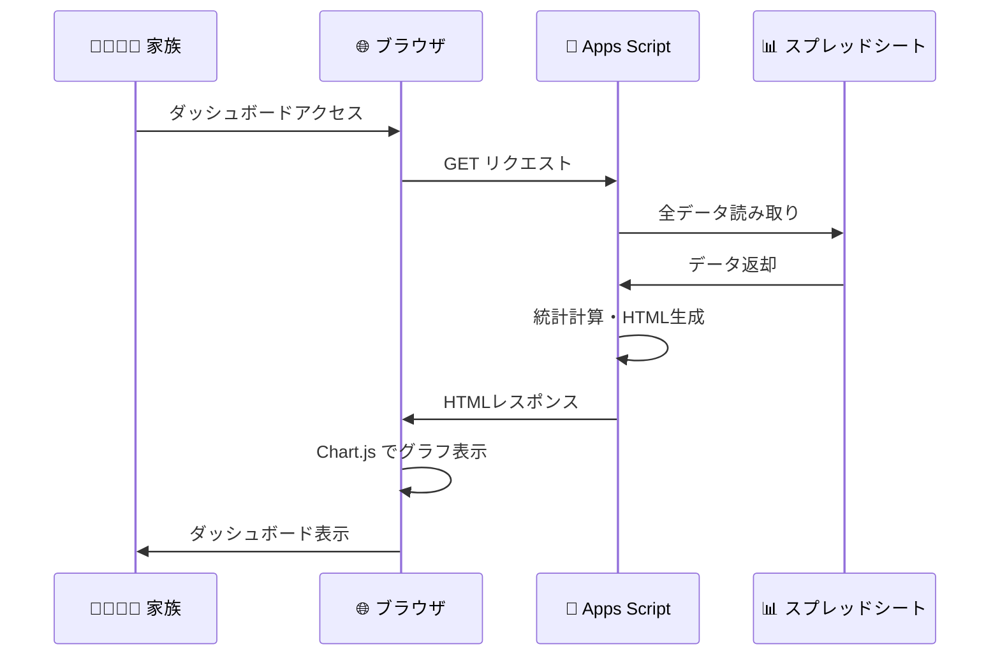
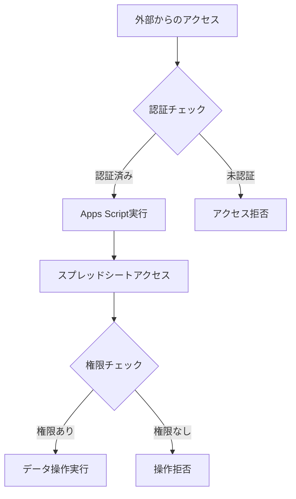
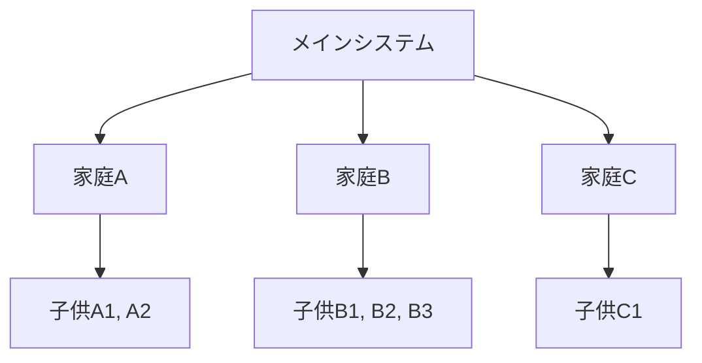
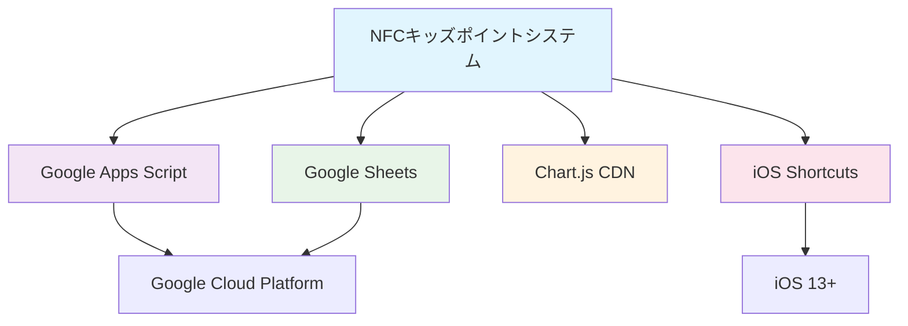
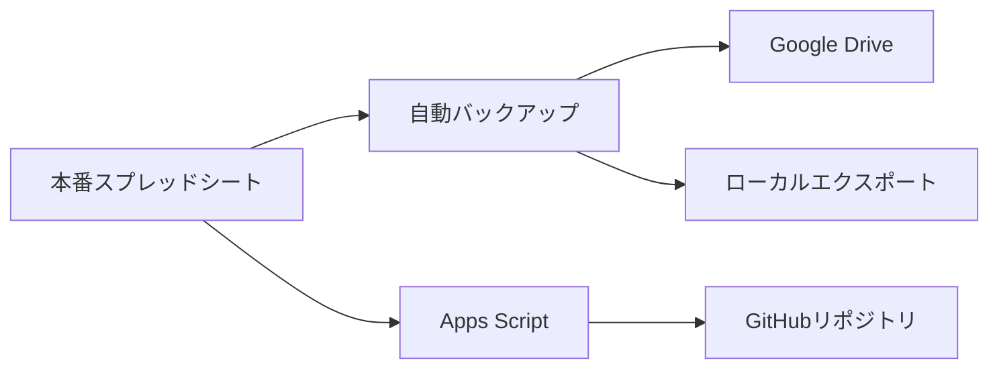

# システム構成図 🏗️

NFCキッズポイントシステムの全体構成と動作フローを説明します。

## 📋 システム概要



## 🔄 データフロー

### 1. ポイント記録フロー



### 2. ダッシュボード表示フロー



## 🏗️ アーキテクチャ詳細

### システム構成要素

#### 1. フロントエンド層
```
📱 iPhone ショートカット
├── NFC読み取り処理
├── JSONデータ生成
├── HTTPリクエスト送信
└── ユーザー通知

🌐 Webダッシュボード
├── HTMLインターフェース
├── Chart.js グラフ表示
├── レスポンシブデザイン
└── リアルタイム更新
```

#### 2. バックエンド層
```
🔧 Google Apps Script
├── doGet() - ダッシュボード生成
├── doPost() - データ受信・保存
├── createDashboard() - メイン画面
├── createUserDetail() - 詳細画面
└── 統計計算エンジン
```

#### 3. データ層
```
📊 Google スプレッドシート
├── ユーザー別シート (子供1人につき1シート)
├── タイムスタンプ記録
├── NFC ID管理
└── ポイント累積データ
```

## 📊 データ構造

### スプレッドシートスキーマ

#### ユーザーシート（例：太郎シート）
| A列 | B列 | C列 | D列 |
|-----|-----|-----|-----|
| タイムスタンプ | NFC ID | タグ名 | ポイント |
| 2024-11-18 09:30:15 | nfc-taro-001 | 太郎 | 1 |
| 2024-11-18 14:20:30 | nfc-taro-001 | 太郎 | 3 |
| 2024-11-18 18:45:22 | nfc-taro-001 | 太郎 | 2 |

### JSON API フォーマット

#### POSTリクエスト（ポイント記録）
```json
{
  "nfcId": "nfc-taro-001",
  "tagName": "太郎",
  "points": 1
}
```

#### レスポンス（成功時）
```json
{
  "status": "success",
  "nfcId": "nfc-taro-001", 
  "tagName": "太郎",
  "points": 1
}
```

#### レスポンス（エラー時）
```json
{
  "status": "error",
  "message": "エラーメッセージ"
}
```

## 🔐 セキュリティ設計

### アクセス制御


### セキュリティ対策

#### 1. Apps Script設定
- ✅ Webアプリとして公開（限定公開）
- ✅ 実行権限：自分のアカウント
- ✅ アクセス権限：設定に応じて調整可能

#### 2. データ保護
- ✅ Google認証による保護
- ✅ HTTPS通信の強制
- ✅ スプレッドシートアクセス権限管理

#### 3. NFC セキュリティ
- ✅ 固有NFC ID による識別
- ✅ 物理的なタグ管理
- ✅ 不正利用検知（異常なアクセス監視）

## ⚡ パフォーマンス最適化

### 1. フロントエンド最適化
```javascript
// 遅延読み込みによる高速化
const observer = new IntersectionObserver(function(entries) {
  entries.forEach(function(entry) {
    if (entry.isIntersecting) {
      const index = parseInt(entry.target.dataset.chartIndex);
      createChart(index);
      observer.unobserve(entry.target);
    }
  });
}, observerOptions);
```

### 2. バックエンド最適化
- ✅ 統計計算の効率化
- ✅ HTMLテンプレートの最適化
- ✅ データ取得の最小化

### 3. キャッシュ戦略
```javascript
// Chart.js CDN キャッシュ活用
<script src="https://cdn.jsdelivr.net/npm/chart.js@4.4.0/dist/chart.umd.min.js"></script>

// 15分間のクエリキャッシュ（将来の拡張として）
```

## 📈 スケーラビリティ

### 現在の制限と対応

#### Google Apps Script制限
| 項目 | 制限 | 対応策 |
|------|------|--------|
| 実行時間 | 6分/回 | 処理の分割・最適化 |
| トリガー | 20個/スクリプト | 効率的なトリガー設計 |
| URLフェッチ | 20,000回/日 | キャッシュ活用 |

#### スプレッドシート制限
| 項目 | 制限 | 対応策 |
|------|------|--------|
| セル数 | 500万セル | シート分割・アーカイブ |
| 同時編集 | 100ユーザー | 通常家庭利用では問題なし |

### 拡張可能性

#### 1. 多家庭対応


#### 2. 機能拡張
- 📊 より詳細な統計機能
- 🎯 目標設定・達成追跡
- 🏆 レベルシステム・バッジ機能
- 📱 スマートフォンアプリ化
- 🔔 プッシュ通知機能

## 🛠️ 技術スタック

### 使用技術
```
フロントエンド:
├── HTML5
├── CSS3 (Flexbox/Grid)
├── JavaScript (ES6+)
└── Chart.js v4.4.0

バックエンド:
├── Google Apps Script
├── Google Sheets API
└── Google Drive API (間接利用)

インフラ:
├── Google Cloud Platform
├── Google Workspace
└── CDN (chart.js)

開発・デプロイ:
├── Google Apps Script Editor
├── Git (バージョン管理)
└── GitHub (ソースコード管理)
```

### 依存関係


## 🔄 システム運用

### 監視・メンテナンス

#### 1. 日常監視
- ✅ ダッシュボードの動作確認
- ✅ データ記録の正常性チェック
- ✅ 異常なポイント増加の監視

#### 2. 定期メンテナンス
- 📅 月次：統計データの分析
- 📅 四半期：システムパフォーマンス評価
- 📅 年次：データアーカイブ・バックアップ

#### 3. バックアップ戦略


---

**次のステップ**: [セットアップガイド](setup-guide.md)でシステムの導入手順を確認してください。